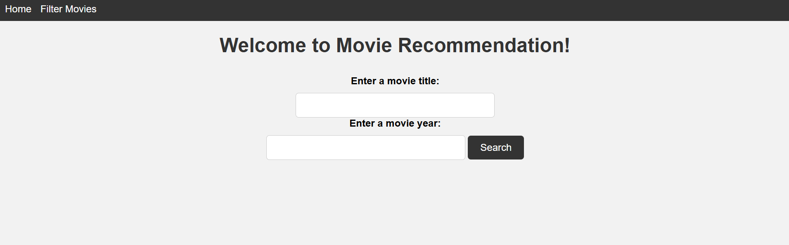

# Django Movie Recommendation System

This is a Django-based web application that allows users to search for specific movies and discover movies through various filters like genre, release date, and more. The application uses the OMDb API to fetch movie data and provide recommendations.

## Features
- Search Movies by Title: Users can search for specific movies by entering a title in the search bar.
- Filter Movies by Year: Users can filter movies by release year.
- Movie Details: View detailed information about each movie, including plot, actors, and ratings.
- Movie Recommendations: The application provides movie recommendations based on a selected movie.


## Installation
This website is available at https://movie.someonewhoexists.hackclub.app/

If you want to replicate this project on your local machine, follow these steps

### Prerequisites
- Python 3.x
- Django 3.x or later
- An API key from OMDb

### Step 1: Clone the Repository
```bash
git clone https://github.com/someonewhoexists/MovieRec.git
cd MovieRec
```

### Step 2: Set Up a Virtual Environment
```bash
python -m venv venv
source venv/bin/activate  # On Windows use `venv\Scripts\activate`
```

### Step 3: Install Dependencies
```bash
pip install -r requirements.txt
```

### Step 4: Configure Environment Variables
Create a .env file in the project root and add your OMDb API key:
```makefile
API_KEY=your_omdb_api_key

```

### Step 5: Run Migrations
```bash
python manage.py migrate
```

### Step 6: Run the Development Server
```bash
python manage.py runserver
```
Visit http://127.0.0.1:8000/ in your web browser to view the application.

## Usage
### Search for a Specific Movie
1. Navigate to the search page.
2. Enter the movie title in the search bar.
3. Click "Search" to view the results.

### Discover Movies Through Filters
- Use the filter options to narrow down movies by release year.
- Click "Search" to view movies that match your criteria.
- Note: The results will be from this project db, so as more people use the search feature (specific movie one), the more options will be shown. 

### View Movie Details
1. Click on any movie from the search results.
2. View detailed information such as the plot, actors, director, and IMDb rating.

### Get Movie Recommendations
- Based on a selected movie, the app may provide recommendations for similar movies.
- Explore these recommendations to discover new movies.

## API Usage
This project uses the OMDb API to fetch movie data. Ensure you have a valid API key from OMDb and include it in the .env file as shown in the installation steps.

## Screenshot


## Contributing
Contributions are welcome! Please fork this repository and submit a pull request with your changes.

## Contact
You can email me at (darshdiv20@gmail.com)[mailto:darshdiv20@gmail.com] if you encounter any bugs etc.